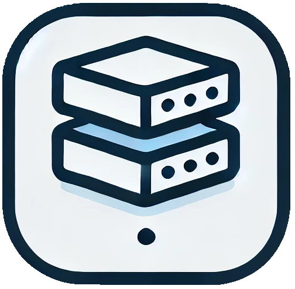

# Custom WireMock Project

## Overview

This project creates a custom WireMock server for mocking RESTful services. It’s designed to run as a standalone service and can be configured via a simple properties file. Ideal for testing and developing against mock APIs.

## Features

- **Request Mapping**: Supports GET, POST, PUT, DELETE requests with customizable response mappings.
- **Configurable**: Define all behavior via the `config.properties` file.
- **Flexible URL Matching**: Use regex to match URLs and request bodies.
- **Docker Support**: Run seamlessly in Docker with minimal setup.

## Prerequisites

- **Docker**: Required for running the server in a containerized environment.
- **Java**: Required if running locally from an IDE.
- **Configuration Files**: Ensure the `config.properties` and response files are correctly placed.

## Setup Instructions

### Local Setup (IDE)

1. Place `config.properties` and `__files` in `src/main/resources/`.
2. Run the `main` function with the argument `local`:

   ```bash
   java -jar application.jar local
   ```

### Docker Setup

1. **Directory Structure**: Organize your project as follows:

   ```plaintext
   ├── docker-compose.yml
   └── resources
       ├── __files
       │   ├── addEmployee.json
       │   ├── deleteEmployee.json
       │   ├── helloWorld.json
       │   └── updateEmployee.json
       └── config.properties
   ```

2. **Docker Compose File**: Create a `docker-compose.yml` file:

   ```yaml
   version: "3.8"

   services:
     echoserve:
       image: docker.io/jaracogmbh/echoserve:1.0.0
       platform: linux/amd64
       volumes:
         - ./resources:/data:ro
       ports:
         - "8089:8089"
   ```

3. **Running the Server**: From the directory containing `docker-compose.yml`, run:

   ```bash
   docker-compose up
   ```

## Configuration

### Request Mapping Configuration

Each request configuration in `config.properties` must follow a specific format:

```properties
request1.requestType=GET
request1.statusCode=200
request1.url=/helloWorld
request1.contentType=application/json
request1.response=helloWorld.json
```

- **Request Configuration**:
  - **Prefix**: Each configuration starts with `request` followed by a unique identifier.
  - **Properties**:
    - `requestType`: The HTTP method (GET, POST, PUT, DELETE).
    - `statusCode`: The HTTP status code to return.
    - `url`: The URL path to map.
    - `contentType`: The response content type.
    - `response`: The file containing the response body.
    - `requestBody`: (For POST and PUT) The expected request body.

### URL and Request Body Matching

Utilize WireMock's `urlMatching` functionality for regex-based matching:

```properties
request1.requestType=GET
request1.statusCode=200
request1.url=/getEmployee\\?([a-z]*)=([0-9]*)
request1.contentType=application/json
request1.response=employee.json

request2.requestType=POST
request2.statusCode=200
request2.requestBody=.*
request2.url=/addEmployee
request2.contentType=application/json
request2.response=addEmployee.json
```

- **Examples**:
  - The first request matches the URL `/getEmployee?id=1`.
  - The second request matches any non-empty POST body.

### Response Files

- Response files should be placed in a `__files` directory.
- By default, this directory is located at `src/main/resources/`.
- The location can be customized in the configuration file.

### Non-Request Configuration Properties

The server's behavior can be configured via `config.properties` with the following properties:

- **port**: The port on which the server runs.
- **hostname**: The hostname for the server.
- **fileLocation**: The location of the response files and configuration file.
  - The `__files` directory is located at `src/test/resources/` by default.
  - When running the server from an IDE, the default location is `src/main/resources/`.
  - When using Docker Compose, set this to `/data` inside the container.

## Running the Server

- **Local**: Run the server with the command:

  ```bash
  java -jar application.jar local
  ```

- **Docker**: Run the server using Docker Compose:

  ```bash
  docker-compose up
  ```

## Example Configuration and Response Files

This example demonstrates how to set up your configuration file and response file for the Custom WireMock Project.

#### `config.properties`

Place this file in the `/resources` directory. It defines the configuration for a GET request to the `/helloWorld` endpoint, returning a JSON response.

```properties
fileLocation=/data
hostname=localhost
port=8089
request1.requestType=GET
request1.statusCode=200
request1.url=/helloWorld
request1.contentType=application/json
request1.response=helloWorld.json
```

#### `helloWorld.json`

This file contains the JSON response for the configured endpoint. It should be placed in the `/resources/__files` directory.

```json
{
  "message": "Hello World"
}
```

### File Locations

Ensure the following file structure is in place:

```
.
└── resources
    ├── config.properties
    └── __files
        └── helloWorld.json
```

- `config.properties` should be located in the `/resources` directory.
- `helloWorld.json` should be located in the `/resources/__files` directory.

### Response 

```json
{
  "message": "Hello World"
}
```
## Troubleshooting

### Common Issues

- **No Config Directory Given**: Ensure the `config.properties` file is correctly placed and accessible.
- **File Permissions**: Verify that the files have the correct permissions for the Docker container.

<div></div>
